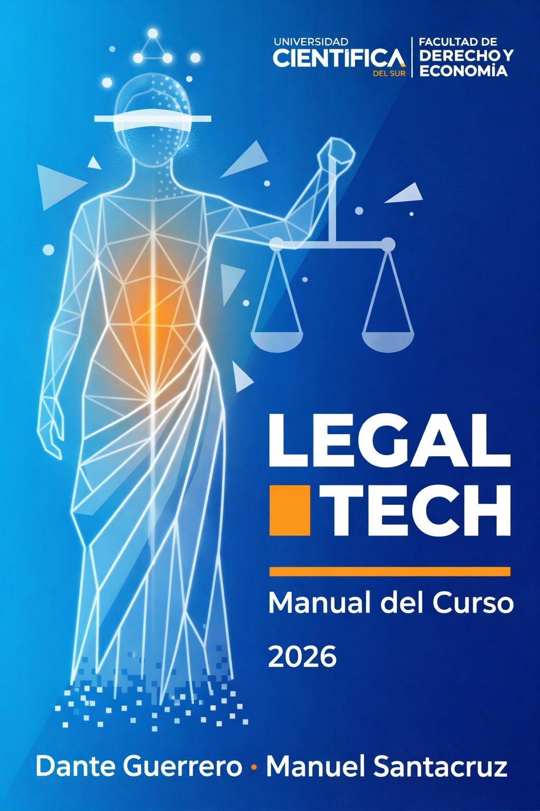

::: {.content-hidden when-profile="docx"}

<h2>¡Bienvenidos/as!</h2>

Este es el <strong>Manual del curso Legal Tech</strong>, una guía para comprender cómo el derecho puede dialogar con la tecnología de manera crítica, práctica e innovadora. A lo largo del curso explorarás conceptos, herramientas y casos que ya están transformando la profesión jurídica, con el propósito de desarrollar criterios para analizar problemas, proponer soluciones útiles y actuar con responsabilidad en contextos públicos y privados.

El curso está diseñado para trabajar <strong>leyendo, programando, versionando y resolviendo problemas</strong>. Por eso el libro combina capítulos de sesión, prácticas guiadas, PSETs y una sección de tutoriales para acompañar el trabajo fuera de clase.

<a href="parte-0/profesores.qmd">Conoce a los profesores</a>
<a href="parte-0/intro.qmd">Empieza por la Introducción</a>
<a href="parte-1-modulo-1/00-presentacion.qmd">Explora el Módulo 1</a>
<a href="tutoriales/00-presentacion.qmd">Revisa Tutoriales</a>

:::

::: {.content-visible when-profile="docx"}

{fig-alt="Portada del manual Legal Tech" width="100%"}

:::
