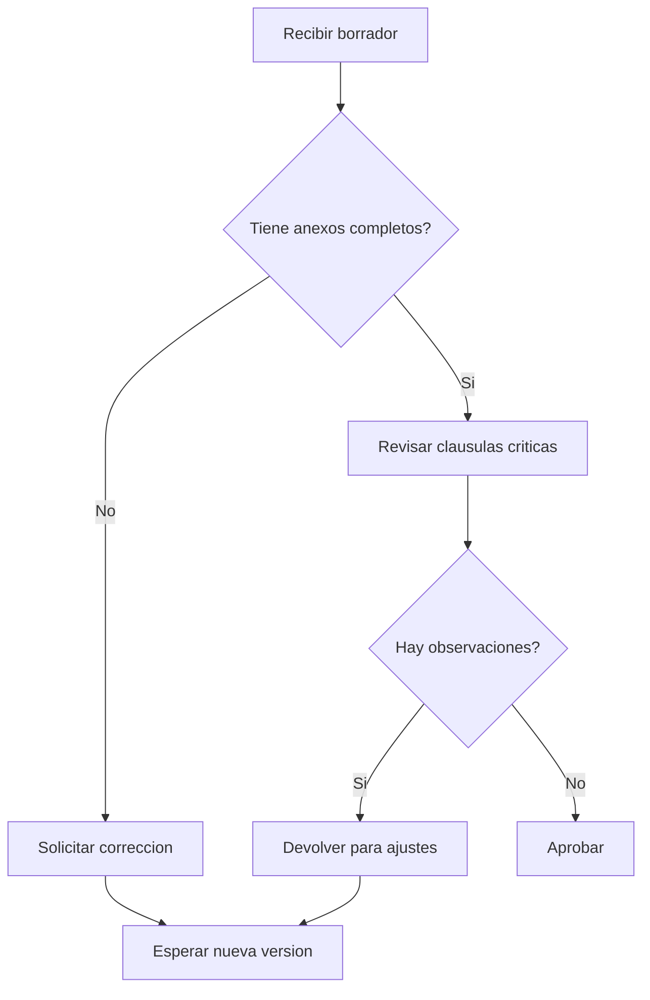

# 5. Entender el negocio

## ¿Por qué importa este tema?

No se puede mejorar ni automatizar un proceso legal si no se entiende primero cómo funciona. Muchos errores en proyectos de innovación aparecen porque se digitaliza un trámite mal descrito, se automatiza una parte irrelevante o se ignora dónde está realmente el cuello de botella.

::: {.callout-important}
## Idea central
Entender el negocio significa entender el proceso: quién hace qué, con qué insumos, en qué orden y dónde aparecen decisiones críticas, demoras, reprocesos o errores repetitivos.
:::

## Qué aprenderás en esta sesión

Al finalizar esta sesión, deberías poder:

- identificar actores, entradas, salidas y puntos de decisión;
- distinguir entre actividad, documento, responsable y resultado;
- representar un flujo legal de manera visual;
- usar Mermaid como herramienta simple de diagramación;
- justificar por qué un proceso fue modelado de cierta forma.

## ¿Qué significa “entender el negocio” en contexto legal?

En entornos de innovación y mejora de procesos, “entender el negocio” no significa vender más ni hablar como consultor por deporte. Significa comprender cómo funciona realmente una organización o una unidad de trabajo.

En derecho, eso obliga a mirar preguntas como estas:

- ¿qué trámite o servicio estamos analizando?;
- ¿qué actor inicia el proceso?;
- ¿qué documentos o datos entran?;
- ¿qué decisiones se toman?;
- ¿qué resultados salen?;
- ¿dónde se pierde tiempo o calidad?;
- ¿qué parte del trabajo es repetitiva y podría estandarizarse?

Si esas preguntas no están claras, cualquier intento de automatización corre el riesgo de ser superficial.

## Un proceso no es solo una lista de tareas

Cuando pensamos en un proceso jurídico, conviene evitar dos simplificaciones:

1. creer que el proceso es solo una secuencia lineal sin decisiones;
2. creer que el proceso se agota en la norma que lo regula.

En la práctica, un proceso suele incluir:

- actividades;
- responsables;
- decisiones;
- documentos;
- tiempos;
- puntos de control;
- posibles desvíos o reprocesos.

Por ejemplo, un procedimiento puede estar muy bien diseñado en papel, pero volverse lento en la práctica porque:

- faltan documentos desde el inicio;
- no se distinguen bien los responsables;
- se revisa varias veces lo mismo;
- no se sabe qué casos deben priorizarse.

::: {.callout-note}
## Regla metodológica
Antes de automatizar un documento o crear un dashboard, conviene entender si el problema real está en el flujo, en los datos o en la distribución del trabajo.
:::

## Elementos básicos de un proceso legal

Un proceso legal o administrativo puede describirse con al menos estos componentes:

- **actor**: quién hace algo;
- **entrada**: qué documento, dato o solicitud ingresa;
- **actividad**: qué se hace con esa entrada;
- **decisión**: qué criterio define si el flujo continúa o cambia;
- **salida**: qué resultado se produce;
- **punto de control**: dónde se valida calidad, integridad o cumplimiento.

Pensemos en un caso sencillo: admisión preliminar de una solicitud.

- actor de entrada: ciudadano o administrado;
- entrada: solicitud y anexos;
- actividad: revisión de requisitos;
- decisión: ¿cumple requisitos mínimos?;
- salida: admisión o formulación de observaciones.

Eso ya permite pensar mejor dónde podría haber:

- errores frecuentes;
- demoras;
- tareas repetitivas;
- oportunidades de mejora.

## Cuellos de botella y reprocesos

Un cuello de botella aparece cuando una parte del flujo concentra demasiada carga, demasiadas validaciones o demasiada dependencia de una sola persona o unidad.

Un reproceso aparece cuando hay que volver atrás porque algo estaba incompleto, mal hecho o mal registrado.

En contextos legales, eso puede verse en situaciones como estas:

- expedientes que regresan varias veces por la misma observación;
- contratos que pasan por demasiadas revisiones sin un criterio claro;
- trámites con entradas incompletas que consumen tiempo antes de ser observados;
- solicitudes que se pierden entre correo, Excel y archivos adjuntos.

Entender el negocio es también detectar ese tipo de patrones.

## Mermaid como herramienta pedagógica

No hace falta empezar con una suite compleja de modelado para aprender a pensar procesos. Mermaid resulta útil porque permite escribir diagramas dentro de un archivo de texto o Markdown, lo cual encaja bien con el trabajo en editor y repositorio.

Una ventaja pedagógica clara es esta:

- obliga a ordenar el flujo;
- permite versionar cambios;
- facilita discutir alternativas;
- deja trazabilidad de la mejora del modelo.

## Ejemplo jurídico: revisión contractual

Un flujo simple de revisión contractual podría verse así:

1. recepción del borrador;
2. revisión preliminar;
3. verificación de anexos;
4. análisis de cláusulas críticas;
5. formulación de observaciones;
6. devolución para ajustes;
7. aprobación o rechazo.

En Mermaid, una primera versión podría comenzar así:

Este diagrama no agota toda la realidad, pero ya vuelve visible algo importante: el flujo no es lineal, tiene decisiones y puede regresar a etapas previas.

## Otro ejemplo: admisión de expediente

También podemos pensar un flujo más cercano al trabajo administrativo:

- recepción del escrito;
- verificación documental;
- revisión de tasa;
- validación de plazo;
- admisión o formulación de observaciones.

Preguntas útiles para modelar este proceso:

- ¿quién revisa qué?;
- ¿qué pasa si falta un documento?;
- ¿se puede detectar antes una observación frecuente?;
- ¿hay casos que deberían priorizarse?;

Esas preguntas ya no son solo técnicas. Son preguntas de diseño de trabajo jurídico.

## Cómo leer un diagrama con criterio

Un diagrama no sirve solo para “bonito”. Debe ayudar a responder cuestiones como estas:

- ¿qué parte del proceso agrega valor?;
- ¿qué parte solo traslada documentos?;
- ¿qué decisión carece de criterio explícito?;
- ¿qué paso podría simplificarse?;
- ¿qué dato falta para medir mejor el flujo?

::: {.callout-tip}
## Criterio útil
Un buen diagrama no muestra todo. Muestra lo necesario para entender el proceso y mejorarlo.
:::

## Del proceso a la mejora

Una vez modelado el flujo, aparecen oportunidades de mejora. Por ejemplo:

- pedir desde el inicio una lista clara de requisitos;
- separar casos simples de casos complejos;
- reducir dobles revisiones innecesarias;
- estandarizar observaciones frecuentes;
- preparar luego automatización documental o visualización de carga.

Ese punto es importante porque conecta directamente este capítulo con el resto del módulo.

## Práctica en editor

Abre tu editor y crea un archivo Markdown con un diagrama Mermaid de un proceso jurídico sencillo. Debe incluir:

- al menos un punto de decisión;
- un responsable o actor identificable;
- una salida final;
- una breve nota sobre un cuello de botella o un punto de control.

## Git y GitHub

Versiona el archivo del diagrama y agrega un comentario breve sobre por qué modelaste el proceso de esa manera. Si haces una segunda versión, deja rastro de qué mejoraste.

## PSET de la sesión

Modela un flujo legal con Mermaid. Puede ser, por ejemplo:

- atención de denuncias;
- revisión de documentos;
- admisión de expediente;
- trámite interno de aprobación;
- revisión de contrato.

El entregable debe incluir:

- el diagrama;
- una breve justificación de actores, decisiones y puntos de control;
- al menos una observación sobre una mejora posible;
- evidencia de trabajo en repositorio.

## Preguntas de repaso

1. ¿Por qué no conviene automatizar un proceso antes de entenderlo?
2. ¿Qué diferencia hay entre una actividad y una decisión?
3. ¿Cómo identificar un cuello de botella?
4. ¿Qué ventaja ofrece Mermaid en un curso como este?

## Ideas clave

- un proceso mal entendido difícilmente se mejora;
- diagramar no es adornar: es pensar con mayor precisión;
- los procesos jurídicos combinan actividades, decisiones, documentos y tiempos;
- modelar bien un flujo prepara el camino para trabajar mejor con datos y automatización.
